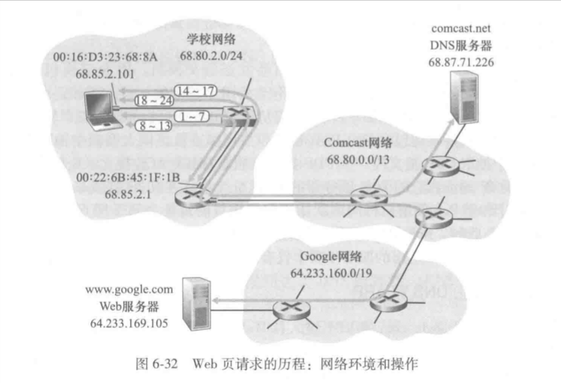

假设Bob使用他的主机与学校的以太网交换机相连，并下载一个Web页面

#### DHCP->UDP->IP->以太网

- 从本地DHCP服务器上获得IP地址以及其他信息：
	1. 主机生成一个DHCPREQUEST报文，其报文被放置在源端口为68（DHCP客户）、目的端口为67（DHCP服务器）的UDP报文段中。UDP报文段被放置在源IP为0.0.0.0、目的IP为广播的IP数据报中。
	2. IP数据报被放置在以太网帧中，其目的MAC地址为广播，源MAC地址为主机MAC地址。
	3. 包含DHCP请求的广播以太网帧是第一个由主机发给交换机的帧。交换机会在所有的出端口广播入帧。
	4. 路由器在入接口（MAC为00:22:6B:45:1F）处收到该帧。从帧中抽出数据报，发现数据报的目的IP地址为广播。因此将载荷（UDP报文段）拆解交给上层协议处理。DHCP请求报文被抽取出来交给DHCP服务器。
	5. 运行在路由器中的DHCP服务器以CIDR块68.85.2.0/24的网络地址分配IP地址。假设路由器将68.85.2.101分配给主机。DHCP服务器生成包含该IP地址、DNS服务器IP地址、默认网关路由器（自己）IP地址、子网块/网络掩码（68.85.2.0/24）的一个DHCPACK报文。该报文被放入UDP报文段中，再层层封装。
	6. 包含该DHCPACK报文的帧被发送给交换机。交换机是自学习的，此时已经知道如何对目的MAC（主机的MAC）寻址，将只向连接主机的输出端口转发。
	7. 主机接收到该帧，抽取出DHCPACK报文。DHCP客户端会记录自己分配到的IP地址和DNS服务器的IP地址。并且在IP转发表中记录默认网关的IP，之后所有非所在子网的数据报都发给网关。此时已经初始化好相关网络组件。（DHCP4个步骤中的DISCOVER和OFFER不是实际必要的）

#### DNS->ARP

- 在Web浏览器中键入www.google.com的URL，引发一系列准备事件：
	1. 为了在TCP套接字中填充URL的HTTP请求，需要先知道该服务器所在的IP地址。主机生成一个DNS查询报文，在问题段中放入URL。该DNS报文被放置在目的端口为53（DNS服务器）的UDP报文段中，该报文段则被放入源IP为主机，目的IP为DNS服务器（上一步中获得）的IP数据报中。
	2. （上一步中的网关MAC地址不会被记录）主机生成一个具有目的IP为网关IP的ARP查询报文并广播。交换机将该帧发给所有设备。
	3. 网关路由器在收到该帧时，发现IP地址与自己匹配，于是将ARP响应报文发往主机。
	4. 主机收到该ARP响应报文，从中抽出网关路由器的MAC地址。
	5. 主机重新包装含有DNS请求报文的数据报，数据报的目的IP为DNS服务器、目的MAC为网关路由器。因此该报文会到达网关路由器。
- 域内路由到DNS服务器：
	1. 网关路由器抽出包含DNS查询的IP数据报，根据数据报的目的IP地址，查询自己的转发表。路由器最终知晓需要将数据报发送给Comcast网络中的左侧路由。（转发表由各种路由选择算法得出）
	2. 该路由器接收到该帧，抽出数据报，检查目的IP地址，根据转发表确定出接口。
	3. 包含DNS查询的IP数据报到达DNS服务器，DNS服务器抽出查询报文，并在自己的DNS数据库中查找该URL。得到URL对应的IP地址的DNS源记录（假设该记录已经缓存在DNS服务器中，源于google.com的权威DNS服务器）。DNS服务器而后生成一个DNS回答报文，放入UDP报文段中寻址到Bob的主机。
	4. 主机从DNS报文中抽出URL对应的IP地址

#### TCP与HTTP

- 此时将产生Web客户-服务器交互：
	1. 主机根据URL的IP地址，生成TCP套接字，但TCP会先执行三次握手，因此主机会先生成一个TCP SYN报文段，目的端口为80。该TCP报文段被封装后发往交换机
	2. 数据报在网络中不断寻址、转发。
	3. 数据报最终到达HTTP器。数据报中取出TCP SYN报文段并交给与端口80相关的套接字，产生一个TCP SYNACK报文段。该报文段被封装发回主机
	4. 同理这一报文段最终在主机中被接收，而后双方达成连接（第三次握手的报文段中可以直接填写数据）
	5. 浏览器生成要获取的页面的URL的HTTP GET报文，该报文被写入套接字，并作为载荷进入TCP报文段
	6. 最终该报文段到达HTTP服务器，TCP套接字读取该报文交给服务器。HTTP服务器生成一个HTTP响应报文，包含对应URL的页面。该HTTP响应报文也要进入套接字。
	7. 该报文段最终到达主机，浏览器从套接字读取HTTP响应，显示了Web页面

