链路层中有两种信道：
1. 广播信道：用于无线局域网、卫星网、HFC（混合光纤同轴电缆）接入网中的多台主机。依靠介质访问协议来协调帧传输
2. 点对点通信链路：长距离链路连接的路由器之间、计算机与邻近以太网交换机之间。依靠很泛用的PPP（点到点协议）

### 链路层概述

- 节点：主机、路由器、交换机、WiFi接入点等任何运行链路层协议的设备
- 链路：沿着通信路径连接相邻节点的通信信道

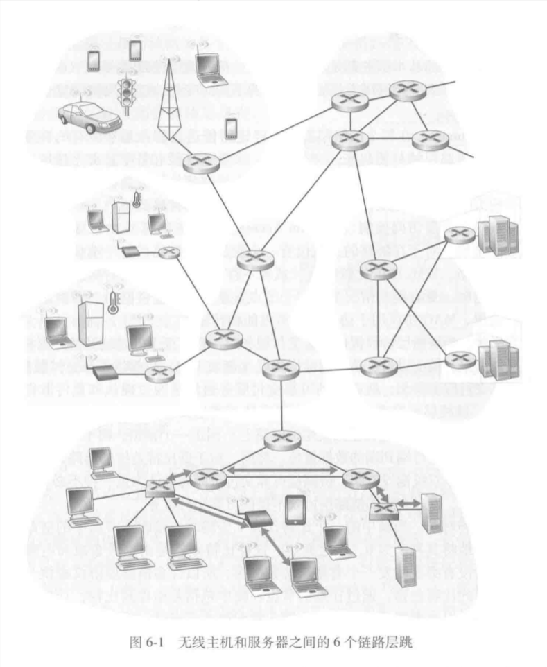当上图中数据报从无线主机发送到服务器时，会在链路中被封装在链路层帧中。

#### 链路层提供的服务

链路层协议细节有所不同，但提供的服务可能如下：
1. 成帧：网络层的协议作为数据字段，与其他首部字段共同组成链路层帧
2. 链路接入：MAC（介质访问控制）协议规定了帧在链路上传输的规则。点对点链路时，无论何时链路空闲，发送方都可以发送帧；多节点共享广播链路时（多路访问），MAC协议负责协调多节点的帧传输
3. 可靠交付：保证无差错的经链路层移动每个数据报，常通过确认和重传保证。在无线链路等高差错率的链路上，通常是在出错的链路上直接纠错，而非通过上层协议迫使进行端到端数据重传；对于光纤等低比特差错的链路，则通常为了减负而不提供可靠交付
4. 差错检测和纠正：由于信号衰减等原因，帧中的比特可能发生错误。许多链路层协议提供一种机制来检测这样的比特差错（发送节点的差错检测与接收节点的差错检查）。相比于上层协议的因特网检验和，链路层更加复杂，并且用硬件实现。接收方通过差错纠正，可以定位差错的位置并进行纠正


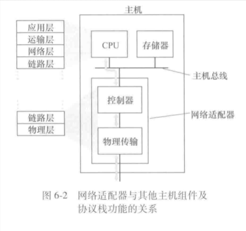
多数情况下，链路层在称为网络适配器的芯片上实现，有时候也称为NIC（网络接口控制器）。在发送端，控制器取得数据报并且可能设置差错检测比特；在接收端，控制器接收整个帧并且可能执行差错检查

部分功能实现在CPU上的软件中

### 差错检测和纠正

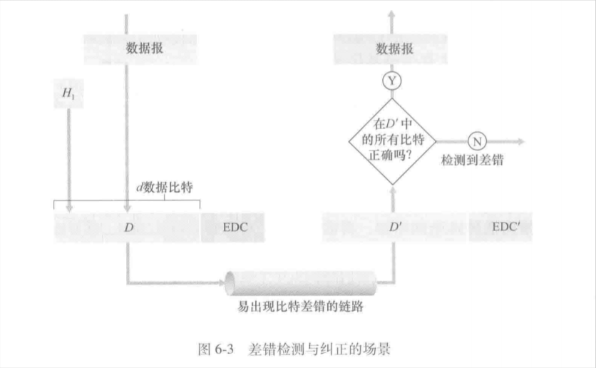
- 在发送节点：为了保护比特（包括首部），使用EDC（差错检测和纠正比特）来增强数据D。D和EDC都会被发送
- 在接收节点：接收方得到比特序列D'和EDC'（此时可能和最初的有所不同），此时接收节点的主要任务是检查D'是否等于D。要注意的是，即使采用EDC，也未必能检查出差错。

主要介绍3中差错检测的技术：
1. 奇偶校验：描述差错检测和纠正背后的思想
2. 检验和方法：一般更多应用于运输层
3. 循环冗余检测：通常应用在适配器中的链路层

#### 奇偶校验（单比特）

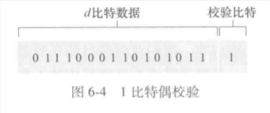
假设在数据D中有d个比特，发送发只需要添加1位校验比特：
- 偶校验：使得d+1个比特中1的总数为偶数
- 奇校验：为奇数

接收方只要数一数d+1中1出现的数据，并且根据校验方式验证即可。但局限在只能检查出奇数个比特差错。

##### 奇偶校验一般化

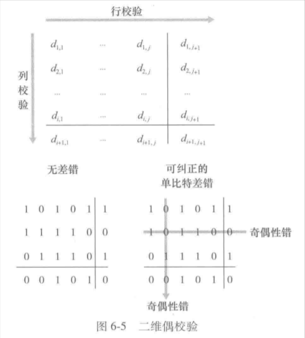
将d个比特划分为i行j列，计算每行每列的奇偶值，最终产生的i+j+1个比特构成了检测比特。

此时如果出现单个比特差错，其所在行列的检测比特都会出错，因此可以准确找到出错的比特并纠正。甚至可以检测出用于校验的检测比特的出错（但这个不能纠正）

接收方检测和纠正差错的能力称为FEC（前向纠错）。FEC有时会和链路层的ARQ技术一起使用。FEC不仅可以减少发送方的重传次数，更可以在接收方主动纠错来减少往返时延

#### 检验和方法


在检验和方法中，d比特将被视作一个k比特整数的序列处理，一个简单的方式是把k比特整数加起来，用得到的和作为差错检测比特。（例如16bit数据视作2个8比特的整数）

这种方法在TCP、UDP中，对所有字段（首部和数据）都计算检验和。

实际上，链路层中经常使用CRC而非检验和，因为链路层的差错检验多在适配器中用专用的硬件实现

#### CRC（循环冗余检测）编码

CRC编码也叫多项式编码

1. 在发送方发送数据D给接收方之前，双方要协商一个r+1比特的模式，称为“生成多项式”，称为G，G的最高位必须为1。
2. 对于d比特，发送方要选择r个附加比特R，并且让D与R相连。使得d+r比特（被解释成一个2进制数）用模2算术恰好能被G整除。
3. CRC检测时，接收方计算d+r/G。如果余数非零，则出错，否则认为正确。

d+r比特模式通过D x 2^r XOR R计算获得。也就是说：  
```text
D*2^r XOR R = n*G
=> D*2^r = n*G XOR R
=> R = remainder(D*2^r/G) #二进制除法
```

例如说，D=101110，d=6，r=3，G=1001。计算可知R=011，所以最终传输的比特位101110011

国际标准定义，8、12、16、32比特都使用G。其中CRC-32 32比特标准被多种链路级IEEE协议采用。

每个CRC标准都能检测小于r+1比特的差错（连续的0到r位差错都可以检测）。此外，在恰当的假设下，超过r+1比特的差错也有1-0.5^r的概率被检测到。  
每个CRC标准都能检测到任何奇数个比特位差错

### 多路访问链路和协议

点对点链路：链路端的单个发送方与单个接收方，例如PPP（点对点协议）、HDLC（高级数据链路控制）
广播链路：多个发送方和多个接收方连接到同一共享信道上，每个节点都会收到副本，例如以太网、无线局域网。

在多对多、既可以发送又可以接收的情况下，需要考虑多路访问问题：多个节点同时传输帧，导致所有节点同时接收到多个帧，此时帧在接收方处发生碰撞。碰撞导致没有节点可以获得任何有效的帧（信号被干扰了），此时所有帧都丢失了，浪费大量带宽。  

为了解决上述问题，诞生了多路访问协议，主要分为以下三种：
1. 信道划分协议
2. 随机接入协议
3. 轮流协议

多路协议的主要目的大致如下（对于速率为R bps的广播信道）：
1. 只有一个节点发送时，该节点独占R的吞吐量
2. M个节点发送时，节点平分R，这一平分是一定时间间隔的平均传输速率，而不是时时刻刻
3. 协议要去中心化，不应该因主节点故障而崩溃
4. 协议实现要尽可能简单

#### 信道划分协议

很早时讲到过TDM（时分多路复用）和FDM（频分多路复用），它们可以在所有共享信道的节点之间划分带宽。

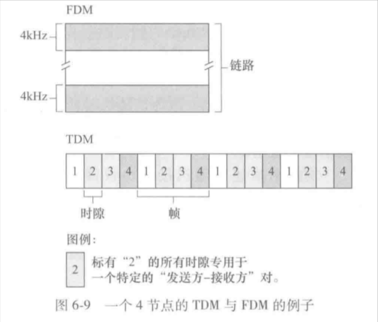
假设一个支持N个节点的信道，传输速率为R bps：
1. TDM将时间划分成时间帧，在时间帧中细分成N个时隙，然后将N个时隙分给节点。无论何时，每个节点可以在循环的TDM帧中，在对应时隙中传输分组比特。通常时隙长度足够传输单个分组。缺点是节点被局限了速率，信道带宽可能被浪费；节点必须等待到自己的时隙
2. FDM将信道划分为不同的频段（每个频段有R/N的带宽），给每个节点分配一个频率，此时节点不需要等待，但仍然被限制了速率
3. CDMA（码分多址）对每个节点分配一种不同的编码，节点用自己唯一的编码来对数据进行编码。对编码加以选择，可以做到节点同时传输、各自的接收方正确接收，而不被干扰

#### 随机接入协议

一个节点总是以信道的全部速率传输，发生碰撞时，涉及到的发送方会反复重发自己的帧，直到成功被接收方获取。在发送之前，每个发送方会等待一个随机时延，时延是独立选择的。

介绍几种随机接入协议。

##### 时隙ALOHA协议

假设以下前提：
- 所有帧为L比特
- 时间被划分成L/R的时隙（一时隙传输一帧）
- 节点只会在时隙开始时传输帧
- 节点是同步的，知道时隙开始时间
- 一个时隙发生碰撞时，所有节点在结束前就会检测到

假设有概率p（独立），那么时隙ALOHA协议的操作如下：
1. 节点有新帧时，等到下一个时隙开始时传输该帧
2. 未发生碰撞，成功传输
3. 发生碰撞，节点检测到。则该节点以概率p在后续的每个时隙中重传，直到成功传输

当只有一个节点发送时，该协议可以很好的工作；多节点时，可能会遇到碰撞导致的带宽浪费、概率p全部不命中导致的信道空闲等问题
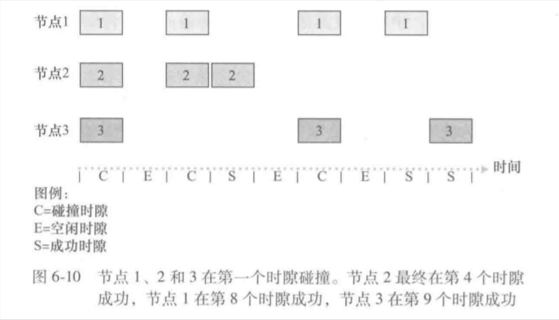
假设有N个节点，始终保持活跃，且概率为p，此时该协议的效率为Np(1-p)^N-1。求极限之后效率约为1/e=0.37。

##### 纯ALOHA协议

纯ALOHA协议是完全分散的。当一帧刚来到链路层时，节点会立刻将该帧传输进广播信道（没有所谓的时隙）。如果发生碰撞，则在传输完该帧后立刻以概率p重传，有1-p概率等待一个帧传输时间。

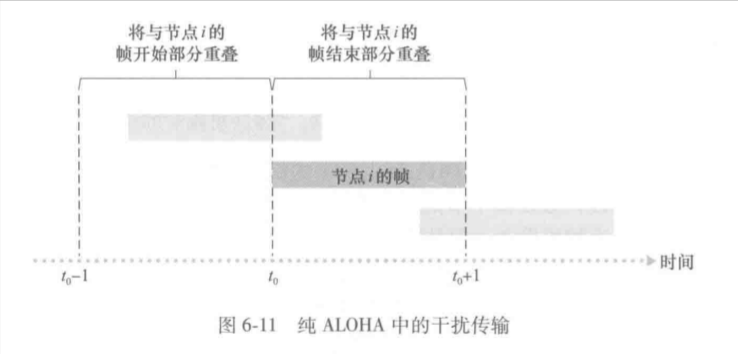
此时协议效率为p(1-p)^(2N-2)。计算得效率为1/2e，是时隙ALOHA协议的一半

##### CSMA（载波侦听多路访问）以及CSMA/CD

前两个协议中，一个节点传输的决定独立于其他节点，从而导致效率底下。

CSMA/CD有两个规则：
1. 载波侦听（继承自CSMA）：节点A在传输前会先监听信道，如果有节点B正在传输，则节点A会等到一段时间都没有任何传输时，再开始传输
2. 碰撞检测（CD）：节点A在传输自己的帧时，会一直监听信道，如果发现有节点B发送干扰帧，则立刻停止自己的传输，此时在再执行第一条规则前，等待一段随机时间

虽然节点们一直在监听，但依然可能会发送碰撞：
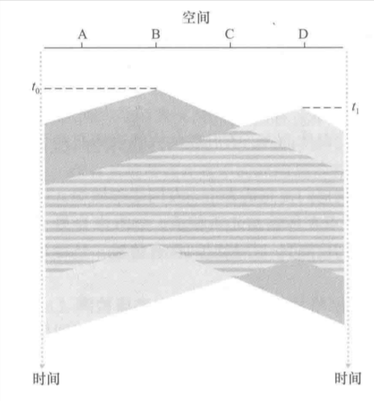
当节点B从t0开始传输帧，时间来到t1，此时节点D决定发送一个帧，但节点B的帧还没到达节点D，导致节点D监听结果为“信道空闲”，从而开始传输。一段时间后，节点B的帧逼近节点D，此时发生干扰。两个节点继续传输。  
该情况主要受到“传播时延”的影响。

因此需要第二条规则：碰撞检测（CD），当节点检测到干扰时，立刻放弃来节省带宽。此后，节点会等待一段时间再继续。
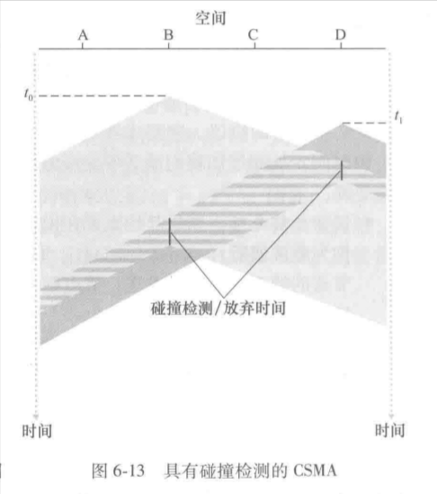

节点碰撞后等待的时间随发送节点数量正相关。

二进制指数后退算法：节点经历了n次碰撞后，随机的从{0, 1, 2, 3, ..., (2^n)-1}中选择一个值K，因此，碰撞次数越多，集合范围越大。以太网中，一个节点等待的实际时间量是512K（发送512比特进入以太网所需时间的K倍），n最大取10。

值得注意的是，适配器在传输一个新的帧时，要运行CSMA/CD算法，新的算法不考虑过去可能发生的状态，因此当其他适配器在等待时，新帧有可能可以立刻传输成功

CSMA/CD效率=1/(1+5Tm/Tn)，Tm为最大传播时延，Tn为传输一个最大长度的以太网帧所需时间。

提一嘴CSMA/CA，与CD在有线连接中使用不同，CA主要在无线网络使用。

#### 轮流协议

ALOHA和CSMA都可以做到单节点时占有全部带宽，但都不能多节点时平均吞吐接近平均值。

介绍两种轮流协议：
1. 轮询协议：要求多节点中择一作为主节点，主节点以循环的方式轮询每个节点。主节点通过观察信道上是否有信号存在，来告知子节点目前能够传输的最大帧数量。但是该协议引入了“轮询时延”且单节点不能达到最大带宽，此外主节点的产生导致了中心化
2. 令牌传递协议：一个称为令牌的特殊帧在节点间以一定顺序交换。当一个节点收到令牌时，如果没有帧要发送，则立刻转发给下一个节点；否则它会发送最大数量的帧，然后转发给下一个节点。但是该协议中可能出现令牌传递出错的问题

#### DOCSIS：用于电缆因特网接入的链路层协议

在电缆接入网中，提到过的三种协议类型都可能出现。

电缆接入网在电缆网头端将上千个电缆调制解调器与一个CMTS（电缆调制解调器端接系统）连接。而DOCSIS（数据经电缆服务接口规范）定义了电缆数据网络体系结构及其协议。


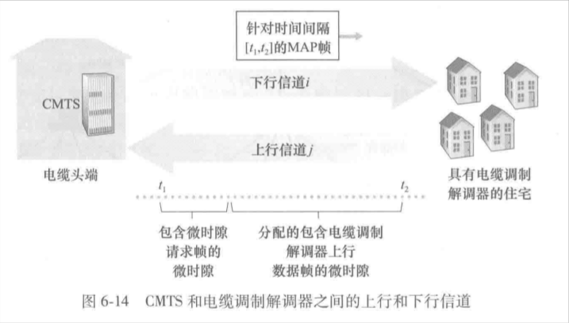
- DOCSIS使用FDM将下行（CMTS到调制解调器）与上行（调制解调器到CMTS）网络段划分为多个频率信道。每个信道都是一个广播信道，上行信道为多对一（可能发生碰撞），下行信道为一对多（所以不存在多路访问问题）
- 每条上行信道被类似TDM的方式划分，CMTS显式的准许对应的调制解调器传输。CMTS在下行信道上发送MAP报文来进行该控制（此时不再碰撞）
- 为了知晓调制解调器的发送需求，CMTS要求它们在特殊时隙中发送请求帧来表达需求，但该请求帧采取随机接入（有可能会碰撞，该碰撞检测交给调制解调器根据超时判断，采取二进制回退）。有时为了避免时隙分配，会直接在特殊间隔中传输数据帧

### 交换局域网

本节开始涉及交换机，部署在链路层，下图为方形。（路由器则是网络层）

由于交换机在链路层，所以不通过OSPF等算法计算网络层地址来确定第二层交换机的路径。

#### 链路层的寻址

主机和路由器有网络层地址（IP地址），它们的网络适配器有链路层地址（MAC地址，也叫LAN地址或者物理地址）。在链路层传输中，发送方不会指定具体的链路层路径，因此交换机等设备不存在链路层地址。

在大多数局域网中，MAC地址长6字节，通常用6x2个十六进制数来表示。MAC地址本身被设置为永久的，但用软件修改是可能的；并且适配器的MAC地址将永不相同

当某适配器向另一个适配器发送一个链路层帧时，会在首部插入目的适配器的MAC地址，然后将该帧发送到局域网中。而交换机会偶尔将一个入帧广播到它所有其他的接口，当适配器接收到一个帧时，检查目的MAC地址是否和自己匹配，从而决定去留。  
- 特殊情况：当某适配器确实希望所有适配器都接收且处理自己发送的帧时，会在目的MAC地址字段中插入特殊的“MAC广播地址”（全为1）

#### ARP（地址解析协议）

简单来说就是将IP地址解析为MAC地址。RARP协议则是反过来。


假设交换机广播所有帧。此时在该子网中，如果主机C要向主机A发送IP数据报，那么主机C不仅要提供IP数据报，还应该有主机A的目的MAC地址。发送主机中的ARP模块将获取当前局域网中任何IP地址作为输入，并转换成MAC地址。主机C知晓主机A的IP地址，因此ARP模块对照表中项，将MAC地址填入对应字段。

每台主机/路由器在内存中维护一个ARP表，每条表项包含：IP地址、MAC地址、TTL。

当发送主机的ARP表中存在对应IP项时，解析是很简单的；但假设主机C决定发给主机A，此时表中没有对应项，因此发生以下操作：
1. 发送方构造一个ARP查询分组，该分组包含源目IP地址和自己的MAC地址。
2. 然后将该分组交给适配器，适配器使用MAC广播地址来广播该分组。
3. 每个接收到该分组的适配器都会将其交给自己的ARP模块，ARP模块检查分组中的目的IP地址和自己的IP地址是否对应，如果是，则将自己的MAC地址填入ARP响应分组，发回给发送方（发回时不广播）。
4. 发送方收到ARP响应分组，更新自己的ARP表。
5. 重新解析并发送数据报。

ARP协议是即插即用的，其ARP表不需要配置。当主机离开子网时，其表项最终会在子网的节点的表中删除。

ARP协议可以视作网络层协议，也可以视作链路层协议。

##### 发送到子网外

假设子网中的左下主机要向子网外的右下主机发送数据报：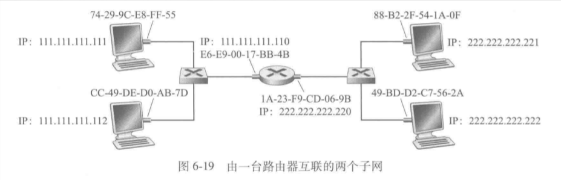
- 每台主机只有一个IP地址和适配器、ARP模块；路由器的每个接口都有一个IP地址，并且每个接口都有一个适配器和ARP模块。每个适配器都有MAC地址
- 源主机将网关IP地址的MAC地址作为目的MAC地址，因此数据报被包装好后送到路由器；路由器查询转发表，确定出接口，然后该接口将数据报重新包装送进新子网，此时的帧的目的MAC地址为右下主机的MAC地址（由此可以得知，发往子网外的数据报在封装时，目的MAC地址将始终是网关的MAC地址）

#### 以太网链路层帧

以太网是当今最流行的有线局域网技术。

20世纪末大多数公司/学校使用基于hub（集线器）的拓扑以太网来作为局域网。hub是一种物理层的设备，它直接作用于比特，当比特到达一个接口时，它只是重新生成该比特并且放大其能量，从而传输到其他接口。当hub在两个接口同时接收到帧时，会发送碰撞。

hub的特点：
- 每个hub可以扩展100m的节点传输距离
- 故障时不影响局域网其他部分运行
- 未隔离冲突域，导致多层吞吐量依然等于单段吞吐量
- 不支持不同类型的以太网

hub目前已被交换机替代

##### 以太网帧的结构

假设一台主机向另一台主机发送一个IP数据报（处于同一子网内）：

- 数据（46~1500字节）：承载了IP数据报。以太网的MTU（最大传输单元）为1500字节，过大的数据报会被分片。数据字段最少为46字节，如果数据报过小，则会被填充，接收方的网络层用数据报首部的长度字段来去除填充
- 目的地址（6字节）：目的适配器的MAC地址
- 源地址（6字节）：源适配器的MAC地址
- 类型（2字节）：该字段指明数据的类型（也就是属于哪种网络层协议），之前说的ARP分组为“0x0806”；IP协议为“0x0800”
- CRC（4字节）：接收方适配器差错检测
- 前同步码（8字节）：前7字节都为“10101010”，第8个字节为“10101011”。前7个字节用于唤醒接收方适配器，并且将时钟和发送方时钟同步（由于各种原因，发送方传输帧的速率有漂移）。第8个字节的最后两位1表示接下来是以太网帧。

所有的以太网技术都向网络层提供无连接服务，不需要握手；但同时是不可靠的，因此需要CRC校验，但CRC校验后，也不会发送确认帧或否定确认帧。如果该帧被丢弃，那么：当高层使用UDP时，接收方可以发现数据传输中的间隙；使用TCP时，会导致发送方的重传，但以太网不知道自己已经传输过该数据报。

G bps以太网有以下特征：
- 使用标准以太网帧格式，向后兼容新技术
- 在点对点链路中使用交换机；在广播信道中使用集线器
- 使用CSMA/CD来共享广播信道
- 允许点对点信道Gbps全双工操作

#### 链路层交换机

交换机的任务是：接收链路层帧并转发出链路。  
交换机自身对子网中的主机/路由器是透明的，意味着不会成为选择对象。  
帧到达交换机输出接口时速率可能会超过链路容量，因此交换机会在输出接口设置缓存。

##### 过滤与转发

过滤指决定帧要转发还是丢弃；转发指决定帧要去往哪个接口，并完成帧的移动。  
这两个功能依靠交换机表实现。
- MAC地址
- MAC地址对应的接口
- 表项存入的时间
假定目的MAC地址为D的帧在接口x进入交换机，交换机查询表，有以下3种情况：
1. 表中无地址D。交换机向x以外的所有接口的输出缓存中转发该帧的副本（也就是广播）
2. 有地址D，但对应接口为x。交换机直接丢弃该帧
3. 有地址D，对应接口y。交换机向接口y的输出缓存中转发该帧

##### 自学习

交换机表是自动、动态、自治的即插即用全双工设备。
交换机的自学习依靠以下条件实现：
1. 交换机初始为空
2. 在每个接口接收到的入帧，存在表中。交换机通过这种方式记录了发送节点的网段。
3. 一段时间后，如果交换机依然没有收到该地址作为源地址的帧，则删除该地址。如果是PC之间被替换了，原PC的MAC地址就会被清除

##### 交换机的性质

交换机不同于总线或者基于集线器的广播链路，它具有以下优点：
1. 消除碰撞：交换机缓存帧，并且不会在网段上同时传输多个帧，因此只有极少数情况下会有碰撞。交换机的最大聚合带宽是所有接口的速率之和，比广播链路的性能强大
2. 异质的链路：交换机隔离不同的链路，因此链路可以以不同的速率运行在不同的媒介上
3. 管理：安全性增强的同时，更加易于网络管理。例如在工作中如果交换机检测到适配器工作异常，则会在内部断开该连接；交换机会收集带宽使用的统计数据、碰撞率、流量类型。

交换机和路由器都是存储转发分组的设备，分别属于二层和三层。  
二者对比如下：
1. 交换机即插即用，路由器需要配置且分组处理时间稍长
2. 为了防止广播帧的循环，交换网络的活跃拓扑限制为一棵生成树
3. 交换机不考虑广播风暴，可能会转发所有帧导致以太网崩溃
4. 网络寻址是分层次的（MAC寻址由于唯一性是扁平的），因此几乎不会产生路由器循环（配置错误另说），可以通过算法计算最佳路径
5. 对广播风暴提供防火墙保护

#### 虚拟局域网VLAN

局域网通常为等级结构，经过一个交换机等级结构进入其他交换局域网。这种结构有一些缺点：
1. 缺乏流量隔离：虽然有等级结构的隔离，但广播流量依然会跨越整个网络，这一广播应该有范围。
2. 交换机的无效使用：只使用一台交换机不能提供流量隔离
3. 管理用户：某台PC可能经常需要移动MAC接口

VLAN应运而生。支持VLAN的交换机允许经一个单一的物理局域网设施定义多个虚拟局域网
- 在一个VLAN间的主机彼此通信时，仿佛是经过交换机的，帧只会在VLAN间交付
- 每个VLAN的端口中会形成一个广播域，广播流量不会超出指定端口集合
- 管理员在VLAN交换机管理软件中声明每个端口属于哪个VLAN，交换机便会维护一张端口到VLAN的映射表

此时，跨VLAN的流量需要额外处理：将一个端口与外部路由器相连，该端口同属于两个VLAN。由此两个VLAN经由路由器连接。现在有些设备内部包含一台路由器与一台VLAN交换机，不需要外部路由器。

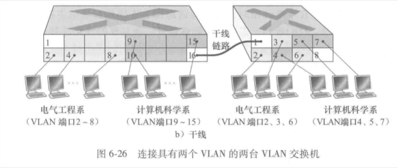
假设有两组VLAN分属于不同的交换机设备，但希望可以实现互联，则需要配置VLAN干线连接：在交换机配置一个特殊端口，该端口属于所有VLAN，因此任何帧都会经过该干线链路。该帧在原有基础上添加了4字节的VLAN标签，承载所属的VLAN标识符，该标签在接收解析被删除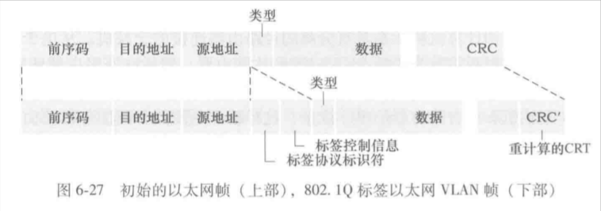
- TPID（标签协议标识符2字节）：固定为0x00~0x81
- 标签控制信息（2字节）：VLAN标识符字段（12bit）和优先权字段（3比特）

本小节提到的VLAN是基于端口的，但VLAN还可以基于MAC等其他方式


### PPP（点对点协议）

是WAN（广域网）点对点串行链路上的封装协议，比HDLC协议有更好的性能，通过LCP（链路控制协议）和NCP（网络控制协议）两种协议工作。

- 串行：一个节点只有两个端口，输出、输入，因此不需要决策转发到哪个路由
- 点对点：串行链路中的节点间只有一条线相连，不需要地址信息

PPP作为协议（与适配器作区分），其应用步骤如下：
1. 使用LCP进行链路建立、设备握手、协商链路参数
2. 在有必要时，使用PAP和CHAP进行身份认证
3. 使用NCP，协商并且配置具体的网络层协议
4. 数据帧的传输
5. LCP进行链路断开

PPP通常用于拨号上网、VPN、专有连接

### 虚电路网络

ATM（异步传输模式）和MPLS（多协议标签交换）是两种常见的分组交换的虚电路网络。

虚电路网络的本质是预先建立一个虚拟路径，不需要占用物理通道；在网络中通过特定的标签进行数据转发，不按照常规的IP路由转发。

优点：
1. 按标签转发，显著提高路由器的转发效率
2. 支持流量工程，精确控制数据流路径来优化带宽分配
3. 支持多协议共存来控制不同业务
4. 可以按照标签，让分组优先转发
5. MPLS可以用于创建多租户的VPN，同时保证客户间数据流不受干扰

