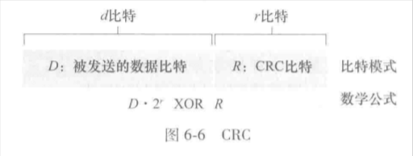

链路层中有两种信道：
1. 广播信道：用于无线局域网、卫星网、HFC（混合光纤同轴电缆）接入网中的多台主机。依靠介质访问协议来协调帧传输
2. 点对点通信链路：长距离链路连接的路由器之间、计算机与邻近以太网交换机之间。依靠很泛用的PPP（点到点协议）

### 链路层概述

- 节点：主机、路由器、交换机、WiFi接入点等任何运行链路层协议的设备
- 链路：沿着通信路径连接相邻节点的通信信道

当上图中数据报从无线主机发送到服务器时，会在链路中被封装在链路层帧中。

#### 链路层提供的服务

链路层协议细节有所不同，但提供的服务可能如下：
1. 成帧：网络层的协议作为数据字段，与其他首部字段共同组成链路层帧
2. 链路接入：MAC（介质访问控制）协议规定了帧在链路上传输的规则。点对点链路时，无论何时链路空闲，发送方都可以发送帧；多节点共享广播链路时（多路访问），MAC协议负责协调多节点的帧传输
3. 可靠交付：保证无差错的经链路层移动每个数据报，常通过确认和重传保证。在无线链路等高差错率的链路上，通常是在出错的链路上直接纠错，而非通过上层协议迫使进行端到端数据重传；对于光纤等低比特差错的链路，则通常为了减负而不提供可靠交付
4. 差错检测和纠正：由于信号衰减等原因，帧中的比特可能发生错误。许多链路层协议提供一种机制来检测这样的比特差错（发送节点的差错检测与接收节点的差错检查）。相比于上层协议的因特网检验和，链路层更加复杂，并且用硬件实现。接收方通过差错纠正，可以定位差错的位置并进行纠正


多数情况下，链路层在称为网络适配器的芯片上实现，有时候也称为NIC（网络接口控制器）。在发送端，控制器取得数据报并且可能设置差错检测比特；在接收端，控制器接收整个帧并且可能执行差错检查

部分功能实现在CPU上的软件中

### 差错检测和纠正


- 在发送节点：为了保护比特（包括首部），使用EDC（差错检测和纠正比特）来增强数据D。D和EDC都会被发送
- 在接收节点：接收方得到比特序列D'和EDC'（此时可能和最初的有所不同），此时接收节点的主要任务是检查D'是否等于D。要注意的是，即使采用EDC，也未必能检查出差错。

主要介绍3中差错检测的技术：
1. 奇偶校验：描述差错检测和纠正背后的思想
2. 检验和方法：一般更多应用于运输层
3. 循环冗余检测：通常应用在适配器中的链路层

#### 奇偶校验（单比特）


假设在数据D中有d个比特，发送发只需要添加1位校验比特：
- 偶校验：使得d+1个比特中1的总数为偶数
- 奇校验：为奇数

接收方只要数一数d+1中1出现的数据，并且根据校验方式验证即可。但局限在只能检查出奇数个比特差错。

##### 奇偶校验一般化


将d个比特划分为i行j列，计算每行每列的奇偶值，最终产生的i+j+1个比特构成了检测比特。

此时如果出现单个比特差错，其所在行列的检测比特都会出错，因此可以准确找到出错的比特并纠正。甚至可以检测出用于校验的检测比特的出错（但这个不能纠正）

接收方检测和纠正差错的能力称为FEC（前向纠错）。FEC有时会和链路层的ARQ技术一起使用。FEC不仅可以减少发送方的重传次数，更可以在接收方主动纠错来减少往返时延

#### 检验和方法


在检验和方法中，d比特将被视作一个k比特整数的序列处理，一个简单的方式是把k比特整数加起来，用得到的和作为差错检测比特。（例如16bit数据视作2个8比特的整数）

这种方法在TCP、UDP中，对所有字段（首部和数据）都计算检验和。

实际上，链路层中经常使用CRC而非检验和，因为链路层的差错检验多在适配器中用专用的硬件实现

#### CRC（循环冗余检测）编码

CRC编码也叫多项式编码

1. 在发送方发送数据D给接收方之前，双方要协商一个r+1比特的模式，称为“生成多项式”，称为G，G的最高位必须为1。
2. 对于d比特，发送方要选择r个附加比特R，并且让D与R相连。使得d+r比特（被解释成一个2进制数）用模2算术恰好能被G整除。
3. CRC检测时，接收方计算d+r/G。如果余数非零，则出错，否则认为正确。

d+r比特模式通过D x 2^r XOR R计算获得。也就是说：  
```text
D*2^r XOR R = n*G
=> D*2^r = n*G XOR R
=> R = remainder(D*2^r/G) #二进制除法
```

例如说，D=101110，d=6，r=3，G=1001。计算可知R=011，所以最终传输的比特位101110011

国际标准定义，8、12、16、32比特都使用G。其中CRC-32 32比特标准被多种链路级IEEE协议采用。

每个CRC标准都能检测小于r+1比特的差错（连续的0到r位差错都可以检测）。此外，在恰当的假设下，超过r+1比特的差错也有1-0.5^r的概率被检测到。  
每个CRC标准都能检测到任何奇数个比特位差错

### 多路访问链路和协议

